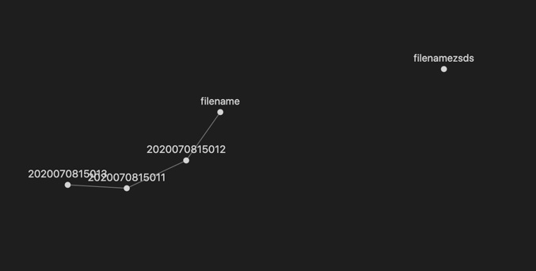

# zknotes

English | [Simplified Chinese](README_CN.md)

`zknotes` is a vscode plugin for applying `zettelkasten` notation.

## Features

### New timestamp title based on zk formatting

1. `Command + Shift + P/ ⇧⌘P / F1` Display Command Panel

2. Select ` new zk note`, enter your title and it will automatically generate a markdown file based on **yyyyMMddHHmm_yourtitle**.

### Support wiki-links with `[[filename]]`.

All zk files in the current directory are displayed when `[[` is entered, and jump to the corresponding file is supported.

The wiki-links of `[[]]` show all zk files in the current directory when you type `[[` and support jumping to the corresponding file. 

### Using vscode's peek definition F12 for block modifications

### graph-view panel to demonstrate Graph neural networks

fork graph-view feature from [`markdown-links`](https://github.com/tchayen/markdown-links), thanks!

1. `Command + Shift + P/ ⇧⌘P / F1` Display Command Panel

2. select `graphView` to generate the corresponding neural network diagram.

## Release Notes

### 0.0.1

First release of `zknotes`.

Feature 1: zk formatted headers / timestamp headers

Feature 2: wiki-links support

### 0.0.2

Feature 1: fork feature from [`markdown-links`](https://github.com/tchayen/markdown-links), support graph view

## Roadmap

- [x] timestamp title
- [x] wiki-links
- [ ] timestamp title add configuration
- [x] graph view