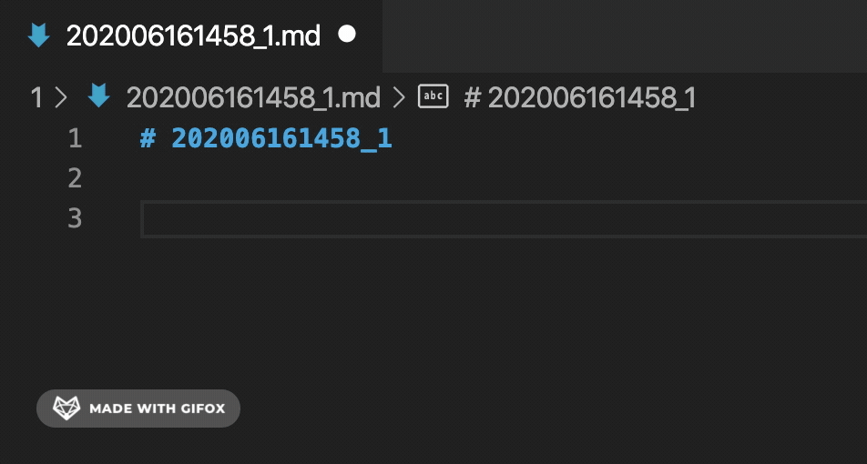
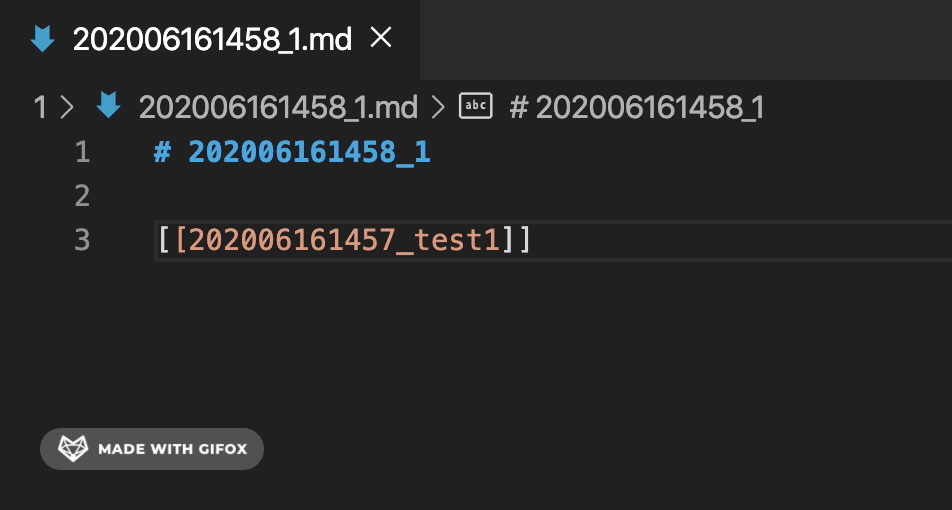

# zknotes

[英文](/README.md) | 简体中文

`zknotes`是一款应用`zettelkasten`笔记法的vscode插件。

## 特性

### 新建基于zk格式的时间戳标题

1. `Command + Shift + P/ ⇧⌘P / F1`显示命令面板

2. 选择`new zk note`，输入你的标题，自动生成基于 **yyyyMMddHHmm_你的标题** 的md文件

### 支持`[[文件名]]`的wiki-links

输入`[[`时显示当前目录下的所有zk格式文件，并且支持跳转到对应文件

### 使用vscode自带的查看定义F12进行block修改

## 发行说明

### 0.0.1

首次发布 `zknotes`.

特性1: zk格式标题 / 时间戳标题

特性2: wiki-links支持

## 路线图

- [x] 时间戳标题
- [x] wiki-links
- [ ] 时间戳标题增加配置
- [ ] graph view
